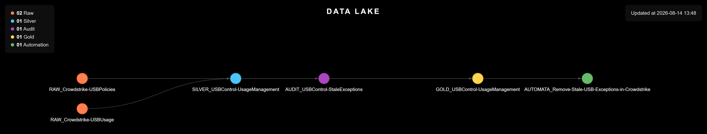

# Device Control (USB)

> Keeps CrowdStrike's USB Device Control exceptions honest: it builds the usage history Falcon does not keep on its own, so an exception nobody uses anymore can be found and revoked instead of sitting open indefinitely.

<p align="center">
  
</p>

<table width="100%">
<thead>
<tr><th>Before<div></div></th><th>Now<div></div></th><th>What it buys<div></div></th></tr>
</thead>
<tbody>
<tr><td>impossible past 7 days — Falcon doesn't keep the data</td><td>a rolling 3–6 month usage history, refreshed weekly</td><td>~8 hours per review, per analyst, replaced by an automatic check</td></tr>
</tbody>
</table>

---

## Why This Project Exists

**Situation:** CrowdStrike Falcon lets specific USB hardware bypass the default block policy, but only keeps usage history for **7 days**; past that, there's no way to tell if a months-old exception is still in use.

**Task:** Build a usage history that outlives Falcon's 7-day window, so exceptions can be checked against real usage instead of staying open indefinitely.

**Action:** Every exception is matched against the rolling usage history — by its combined id, or by vendor+product+serial, or by vendor+product alone, depending on what the exception itself declares — and flagged active or dormant with the machines and dates that prove it, feeding the automation that revokes what nobody uses.

**Result:** The check goes from impossible — the data needed simply doesn't survive past 7 days on the platform — to automatic, replacing roughly **8 hours per review** of manual work per analyst.

---

<details>
<summary><strong>Scripts</strong> (click to expand)</summary>

<table width="100%">
<thead>
<tr><th>Script<div></div></th><th>What it does<div></div></th></tr>
</thead>
<tbody>
<tr><td><code>Scripts/Falcon/1. Extract_Weekly_Usage.py</code></td><td>Authenticates to Falcon and runs an NGSIEM query for the last 7 days of USB/removable-storage events (connected, blocked, policy violation). Appends the new events to the rolling usage history, deduplicates, and drops anything older than 6 months.</td></tr>
<tr><td><code>Scripts/Falcon/2. Extract_USB_Devices.py</code></td><td>Authenticates to Falcon and pulls every Device Control policy, flattening each USB exception (by vendor/product/serial) into one row: the current allow-list.</td></tr>
<tr><td><code>Scripts/3. Generate_USB-Audit-Usage.py</code></td><td>Cross-references the exceptions against the accumulated usage history, matching each one by its combined ID, or by vendor+product+serial, or by vendor+product alone, depending on what the exception itself declares. Outputs one audit row per exception: active or dormant, last seen, and on which machines.</td></tr>
</tbody>
</table>

</details>

<details>
<summary><strong>Usage</strong> (click to expand)</summary>

```
cd Scripts
pip install -r requirements.txt
```

Run on a weekly schedule, so no usage window is lost to Falcon's 7-day retention:

```
python './Falcon/1. Extract_Weekly_Usage.py'
python './Falcon/2. Extract_USB_Devices.py'
python './3. Generate_USB-Audit-Usage.py'
```

</details>
