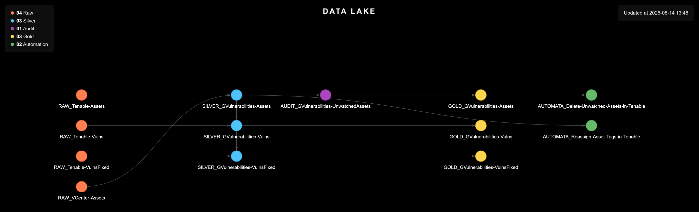

# Vulnerability Management

> Attributes every vulnerability found by Tenable to the department that actually owns the affected server, and builds the risk and exploitability signals a manual export never carried.

<p align="center">
  
</p>

<table width="100%">
<thead>
<tr><th>Before<div></div></th><th>Now<div></div></th><th>What it buys<div></div></th></tr>
</thead>
<tbody>
<tr><td>vulnerabilities sit in Tenable with no route to the owning department</td><td>every vulnerability attributed automatically, through the same VCenter inventory shared across projects</td><td>accepted-risk visibility and exploitability-based prioritization a manual export never carried</td></tr>
</tbody>
</table>

---

## Why This Project Exists

**Situation:** Vulnerabilities live inside Tenable, but nothing routes them to the department that owns the affected server, so the data exists without ever reaching whoever can actually fix it.

**Task:** Attribute every vulnerability to its owning department faster than a manual export, and add what a manual export never carried: accepted-risk visibility and prioritization by real exploitability, not severity alone.

**Action:** Every asset pulled from Tenable is cross-referenced against the VCenter inventory by MAC address, confirming or correcting its department and flagging when Tenable's own tag has drifted from the real owner; whatever cannot be matched is set aside instead of dropped. Every vulnerability — active or fixed in the previous month — is enriched with its exploitability signals (EPSS score, CISA KEV presence, exploit availability and maturity) and attributed through that same cross-reference.

**Result:** Vulnerabilities reach their owning department faster than a manual export, and the pipeline leaves behind what manual exports never did: the raw material for automated KPIs like remediation progress, accepted-risk tracking, and exploitability-based prioritization.

---

<details>
<summary><strong>Scripts</strong> (click to expand)</summary>

<table width="100%">
<thead>
<tr><th>Script<div></div></th><th>What it does<div></div></th></tr>
</thead>
<tbody>
<tr><td><code>Scripts/1. VCenter/1.1. Extract_Assets.py</code></td><td>Pulls the VM inventory from VCenter (hostname, MAC address, department), skipping templates. This is the source of truth used to attribute every asset to the right department.</td></tr>
<tr><td><code>Scripts/2. Tenable/2.1. Extract_Assets.py</code></td><td>Pulls Tenable's asset inventory (agent- and scan-discovered hosts) with its ACR/AES risk scores. Cross-references each asset against the VCenter inventory by MAC address: confirms or corrects its department, flagging when Tenable's own tag has drifted from the real owner, and sets aside whatever it cannot match into an "Unwatched" file.</td></tr>
<tr><td><code>Scripts/2. Tenable/2.2. Extract_Vulns.py</code></td><td>Pulls every active vulnerability (open/reopened) and everything fixed in the previous calendar month. Enriches each with its exploitability signals (EPSS score, CISA KEV presence, exploit availability and maturity), attributes it to a department through the asset cross-reference, and updates the per-severity vulnerability counts back onto the asset records. Vulnerabilities on unmatched assets are set aside separately.</td></tr>
</tbody>
</table>

</details>

<details>
<summary><strong>Usage</strong> (click to expand)</summary>

```
cd Scripts
pip install -r requirements.txt
```

Run in this order: each script depends on the one before it to attribute the right department.

```
python './1. VCenter/1.1. Extract_Assets.py'
python './2. Tenable/2.1. Extract_Assets.py'
python './2. Tenable/2.2. Extract_Vulns.py'
```

</details>
