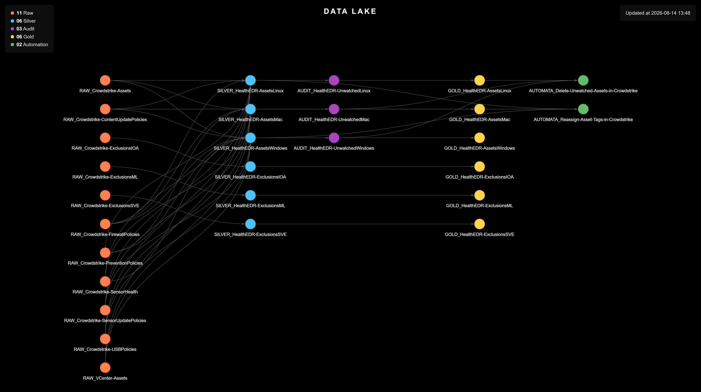

# EDR Health Check

> Turns a day of manual CrowdStrike auditing into an automated report — sensor health, policy coverage and exclusions, cross-referenced against the real server inventory.

<p align="center">
  
</p>

<table width="100%">
<thead>
<tr><th>Before<div></div></th><th>Now<div></div></th><th>What it buys<div></div></th></tr>
</thead>
<tbody>
<tr><td>~8 hours by hand, per client, every cycle</td><td>one automated pipeline, same report</td><td>a consistency no manual version reached</td></tr>
</tbody>
</table>

---

## Why This Project Exists

**Situation:** Building a CrowdStrike EDR health-check report (sensor health, security best practices, configured exceptions) took an analyst roughly **8 hours**, a full day, on a monthly or weekly cadence, and it had to be rebuilt per client. At a day each, doing it by hand for every client stops being feasible.

**Task:** Automate that report so it protects the endpoint perimeter the way the manual version did — sensor status, policy exceptions, security best practices — without costing a day of analyst time per client.

**Action:** Every host pulled from Falcon is cross-referenced against the VCenter inventory to attribute it to the right department; whatever cannot be matched is set aside instead of silently dropped. Every exclusion configured in Falcon — IOA, Sensor Visibility, ML — is captured by type, because a quiet exception is exactly what weakens protection without anyone noticing.

**Result:** The manual report is gone, and what replaced it didn't just save the analyst's **day per client**: the automated reports come out to a noticeably more consistent standard than the manual ones ever did.

---

<details>
<summary><strong>Scripts</strong> (click to expand)</summary>

<table width="100%">
<thead>
<tr><th>Script<div></div></th><th>What it does<div></div></th></tr>
</thead>
<tbody>
<tr><td><code>Scripts/1. VCenter/1.1. Extract_Assets.py</code></td><td>Pulls the VM inventory from VCenter (hostname, MAC address, department), skipping templates. This is the source of truth used to attribute every monitored endpoint to the right department.</td></tr>
<tr><td><code>Scripts/2. EDR/2.1. Generate_Assets.py</code></td><td>Pulls every host from CrowdStrike Falcon: its assigned policies (Prevention, Device Control, Firewall, Sensor Update, Content Update) and its Zero Trust Assessment sensor-health signals, including Reduced Functionality Mode. Cross-references each host against the VCenter inventory by MAC address to assign it a department; hosts it cannot match are set aside in a separate "Unwatched" file per OS instead of silently dropped.</td></tr>
<tr><td><code>Scripts/2. EDR/2.2. Generate_Exclusions.py</code></td><td>Pulls every exclusion configured in Falcon (IOA, Sensor Visibility, and ML): the specific processes, paths or files exempted from detection or prevention, one report per exclusion type.</td></tr>
</tbody>
</table>

</details>

<details>
<summary><strong>Usage</strong> (click to expand)</summary>

```
cd Scripts
pip install -r requirements.txt
```

Run the VCenter extraction first: the EDR script depends on it to attribute hosts to a department.

```
python './1. VCenter/1.1. Extract_Assets.py'
python './2. EDR/2.1. Generate_Assets.py'
python './2. EDR/2.2. Generate_Exclusions.py'
```

</details>
