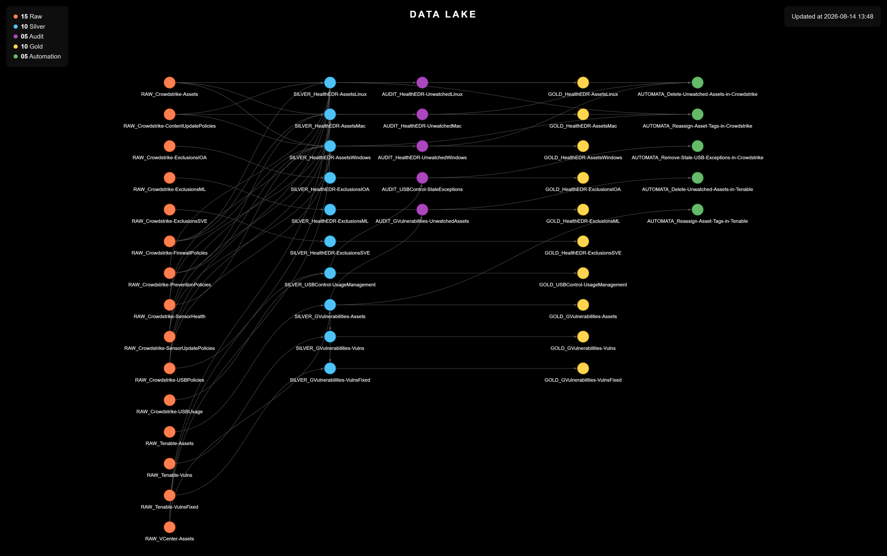

# Data Lake Documentation Catalog

> An automated, visual Data Lake, auto-filled by an AI skill + live projects documented from scratch.

<p align="center">
  <a href="https://jkienen.github.io/Catalog-DataLake_v1/Catalog/DataLake-Graph_Pyvis.html">
    
  </a>
  <br>
  <a href="https://jkienen.github.io/Catalog-DataLake_v1/Catalog/DataLake-Graph_Pyvis.html"><strong>Open the live graph -></strong></a>
</p>

- **What this is:** one YAML file per source, rule, audit, indicator or automation, organized around the **medallion architecture** (Raw → Silver → Gold) plus an **Audit** layer and an **Automation** layer.
- **Who fills it in:** a Claude Code skill reads a project dropped into the catalog and writes the files straight from the code — nobody transcribes by hand.
- **What you get:** an interactive graph, filtered by client, platform and project, where every source, rule and action is one clickable node instead of one row in a shared sheet.

---

## Why This Matters

Automations save time. But each one is a decision made on someone's behalf, silently, on a schedule, using logic only its author can see. Multiply that across teams and platforms, and convenience turns into risk:

- **No one owns the full picture.** Automations get built script by script, each with its own credentials, schedule, and hard-coded rule. Ask "what automatically deletes, tags, or closes something in production right now?" and the honest answer is usually "let me check with a few people."
- **Evidence disappears with the action.** An automation that deletes or closes a record also removes the only proof it existed. When an audit, an incident, or a customer complaint asks why the record is gone, there is nothing to point to.
- **Duplicated effort.** Without a shared catalog, two teams solve the same problem twice, slightly differently, against the same source system — doubling the maintenance burden and the number of places a bug can hide.
- **Institutional risk.** The rule deciding what gets changed or deleted lives in one person's script, in one person's head. When that person is unavailable, nobody can safely extend, or even fully trust, what the automation does.

Every automation here traces back to a **project** — a folder under [`Projects/`](Projects/) holding the code it was built for. `CYBER__HealthEDR` exists to keep EDR sensor health above a threshold. `CYBER__DeviceControl` exists to keep USB exceptions from going stale. `CYBER__GVulnerabilities` exists to track vulnerabilities against the asset inventory. Documenting an automation without naming the problem it solves is documenting an action with no reason attached — the catalog ties the two together by construction, not by convention.

That is the case worth making to a manager: not "we documented our data," but **"we can show, at any moment, everything that acts on our systems automatically, why it does it, and what it did, before an incident forces us to find out the hard way."**

---

## From Spreadsheet to Catalog

This is the second iteration of the project — the first lived in a single Excel workbook, [`Catalog-DataLake_v0`](https://github.com/jkienen/Catalog-DataLake_v0). It did the job until the Data Lake outgrew it: a day of analyst work to document one automation, thousands of rows to scroll through to find one entry, and no structure stopping two rows from describing the same rule differently. Every idea it got right — one entry per source, rule or automation; the medallion architecture; an Audit layer that survives the action erasing its evidence — carries over here. What changed is how entries get produced and how they get read:

<table width="100%">
<thead>
<tr><th><div></div></th><th>v0 — the spreadsheet<div></div></th><th>v1 — this catalog<div></div></th></tr>
</thead>
<tbody>
<tr><td>Unit of documentation</td><td>one row in a shared workbook</td><td>one YAML file per entry</td></tr>
<tr><td>Who fills it in</td><td>an analyst, by hand</td><td>a Claude Code skill, read from the code</td></tr>
<tr><td>Layers</td><td>4, with Audit only a field</td><td>5, with Audit promoted to its own layer</td></tr>
<tr><td>Silver and Gold</td><td>merged into one row</td><td>separate files</td></tr>
<tr><td>Finding an entry</td><td>scroll and filter thousands of rows</td><td>an interactive graph, filtered by client, platform and project</td></tr>
<tr><td>What keeps it consistent</td><td>discipline</td><td>a fixed template per layer</td></tr>
</tbody>
</table>

---

## How It Works

The documentation mirrors the lifecycle of the data across five layers:

<table width="100%">
<thead>
<tr><th>Layer<div></div></th><th>What it holds<div></div></th><th>Documented in<div></div></th></tr>
</thead>
<tbody>
<tr><td><strong>Raw</strong></td><td>Data ingested exactly as the source delivers it, with no transformation.</td><td><code>1-Raw/RAW_*.yaml</code></td></tr>
<tr><td><strong>Silver</strong></td><td>Cleaned, cross-referenced, and structured data, ready for analysis.</td><td><code>2-Silver/SILVER_*.yaml</code></td></tr>
<tr><td><strong>Audit</strong></td><td>Records the pipeline sets apart, kept inside the Silver layer's history so the evidence survives an automation acting on them.</td><td><code>3-Audits/AUDIT_*.yaml</code></td></tr>
<tr><td><strong>Gold</strong></td><td>Business indicators / KPIs derived from the Silver layer.</td><td><code>4-Gold/GOLD_*.yaml</code></td></tr>
<tr><td><strong>Automation</strong></td><td>Automated actions that read the curated data and act back on the platform it came from.</td><td><code>5-Automations/AUTOMATA_*.yaml</code></td></tr>
</tbody>
</table>

Each layer feeds the next: Raw is the input to the Silver rules, the records those rules set apart become Audits, the Silver output is consolidated into Gold indicators, and Automations consume the curated data — and the audits — to act.

---

<details>
<summary><strong>Repository Structure</strong> (click to expand)</summary>

```
Catalog-DataLake/
├── Projects/                       # The source repositories being documented, one problem per project
│   ├── CYBER__HealthEDR/
│   ├── CYBER__DeviceControl/
│   └── CYBER__GVulnerabilities/
└── Catalog/
    ├── Layers/                     # The live catalog: one YAML per dataset, rule, audit, indicator or automation
    │   └── <Client>/
    │       ├── HML/{1-Raw,2-Silver,3-Audits,4-Gold,5-Automations}/
    │       └── PRD/{1-Raw,2-Silver,3-Audits,4-Gold,5-Automations}/
    ├── Skills/
    │   ├── Catalog.md              # The Claude Code skill that documents a dropped project
    │   ├── Templates/              # The five YAML templates, one per layer
    │   └── Temp/                   # Where a dropped project is documented and reviewed before moving to Layers/
    ├── Scripts/
    │   └── Generate-Graph_Pyvis.py # Reads Layers/ and renders the HTML graph
    ├── Files/                      # Images referenced by the documentation
    └── DataLake-Graph_Pyvis.html   # The generated visualization
```

</details>

<details>
<summary><strong>Documenting a New Project</strong> (click to expand)</summary>

Where the spreadsheet asked an analyst to read the code and transcribe it by hand, this catalog asks a Claude Code skill to do the reading:

1. Drop the project's repository into `Catalog/Skills/Temp/<RepositoryName>/`.
2. Ask the skill to document it. It sweeps every API call, business rule, set-aside record, indicator and platform action in the code, and turns each one into a YAML file (`RAW_*`, `SILVER_*`, `AUDIT_*`, `GOLD_*`, `AUTOMATA_*`) following the field-by-field template of its layer.
3. Review the files it wrote in `Catalog/Skills/Temp/`. Nothing reaches the live catalog until you approve them.
4. Once approved, the files move into `Catalog/Layers/<Client>/<HML or PRD>/`, one numbered folder per layer.

The skill only ever reads the dropped project; it never runs its scripts, since those authenticate against production platforms and, in the Automation layer, act on them.

**Benefits:**

- **Fewer nodes**: one node per rule instead of one per manually transcribed entry, cutting redundancy out of the graph.
- **Derived from the code**: every document reflects the rules actually applied in the scripts, not what an analyst remembered while transcribing them.
- **Consistent structure**: every file the skill writes follows the same field-by-field template, no matter who ran it or which project it came from.

</details>

<details>
<summary><strong>Visualizing the Catalog</strong> (click to expand)</summary>

Every YAML file under `Catalog/Layers/` is a node; every `sources_raw`, `sources_silver`, `sources_audit` and `generates_audits` reference is an edge between them. Running `Catalog/Scripts/Generate-Graph_Pyvis.py` reads the whole `Layers/` tree and renders `Catalog/DataLake-Graph_Pyvis.html` — the file served by GitHub Pages at [jkienen.github.io/Catalog-DataLake_v1](https://jkienen.github.io/Catalog-DataLake_v1/Catalog/DataLake-Graph_Pyvis.html). Re-run it after every batch of files moves into `Layers/`, so the graph never drifts from the catalog it was built from.

The result is an interactive graph, one column per layer and colored by layer, filtered by client, platform and project, where opening a node shows its description, sample, owner and schedule.

See [Catalog/Scripts/README.md](Catalog/Scripts/README.md) for setup, the configuration constants, and a note on the CDN dependency the generated page carries.

</details>

---

## License

Provided as-is for reference and reuse. Adapt it freely to your environment.
